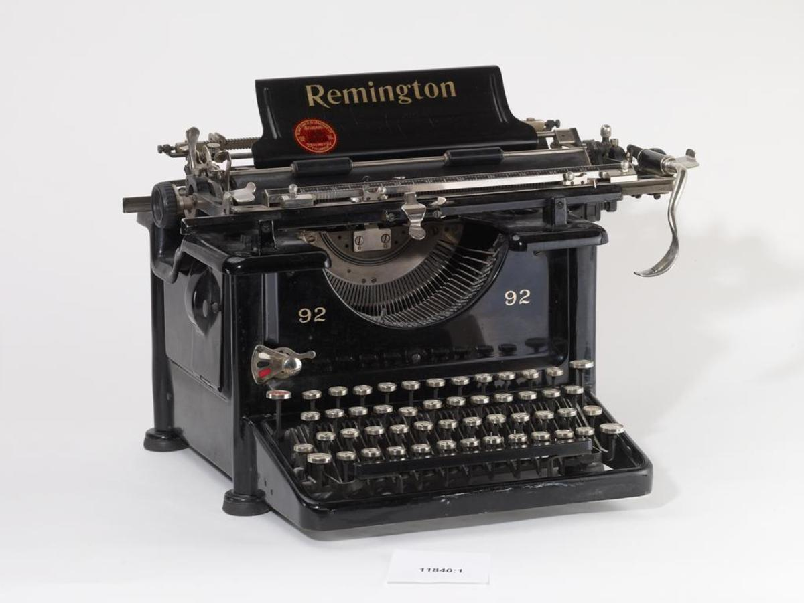

This is a quick reference sheet for managing your website.

# Workflow

1. Open **GitHub Desktop**
   1. Click **Fetch Origin** in the tool bar to pull any changes from the GitHub repository.
   2. Click **Open in Typora**  in the middle of the screen to open the repository for editing.
2. Use **Typora** to edit the source files of your website.
3. To push your changes live, in **GitHub Desktop**:
   1. Fill in a summary in the form in the bottom left, and click **Commit to main** (or `Ctrl+Enter`).
   2. Click **Push origin** in the toolbar.
   3. In a few minutes, your changes should be on the [live site](https://angelacummings.com).

# Website

## File Structure

All files for the website pages must have the extension `.md` – Typora creates new documents with this extension by default but if you’re copying files from someplace else, make sure they are in Markdown.

- Poems, stories and musings go into so-called ‘collections’. They are the folders `_poems`, `_stories` and `_musings`.
- All images used in any of the post or pages should be stored in the `img` folder. (Typora automatically saves them there when you paste an image into a file.)
- Other static pages are stored in the `pages` folder and indicate their URL in the front matter.

Images

Front matter is required for all files that go online.

## Front Matter

To insert a front matter into a file, either select **Paragraph > YAML Front Matter** in **Typora**’s menu (it is the last item in the menu, or type three dashes (`---`) at the very start of the file.

In either case, you can check this when you switch Typora to source code view (`Ctrl+/` or **View > Source Code Mode**). The front matter is the text between  `---` on the first line, and `---` at the end of front matter (automatically inserted by Typora).

If you’ll check the front matter of this file, you’ll see it says:

````
---
title: Cheat Sheet
published: false
---
````

### Front Matter Variables

The front matter stores variables used during the generation of the web pages. Except for `title`, they are all optional.

| Variable              | Explanation                                                  |
| --------------------- | ------------------------------------------------------------ |
| `title: Text`         | The main title of the page. (Required)                       |
| `subtitle: Text`      | Subtitle of the page                                         |
| `published: false`    | Include this if you do not want the file published to the website |
| `date: YYYY-MM-DD`    | Date of the article                                          |
| `lede: true`          | Include this to format the first paragraph as a lede.        |
| `image: filename.jpg` | A featured image of the article. (Stored in `img` folder.)   |
| `caption: Text`       | One line of text shown as the image caption                  |
| `permalink: /link`    | URL of the page. (Do not use for collections.)               |
| `summary: Text`    | Overrides the text used in the article's preview.                    |

# Document Formatting

Please refer to **Typora**’s documentation (**Help > Markdown Reference**) for info about general formatting (headings, lists, emphasis etc.).

## Formatting Tips

- The easiest way to create **links** is by typing the syntax `[link text](https://website.com/page)`, which is also available by right clicking and selecting the hyperlink icon.

- Links to posts and pages on your own website can be shorter:  `[another post](post-title)` when linking from the same folder, or  `[this story](/stories/story-title)` when linking from a different folder.

-  The text of the footnote can be placed anywhere  in the document, and will be moved to the bottom during publishing. The syntax is: `Text[^custom-link] more text` creates a numbered footnote. Then put the text of the footnote as a standalone line anywhere in the document (or using the right-click shortcut Insert > Footnotes):

  `[^custom-link]: Text of the footnote`  

## Custom Formatting

You can create some custom effects. Some of these may be easier done when viewed in the Source Code mode (`Ctrl+/`).

### Poems

For files in the `_poems` collection,  the poem is generated from what is actually a bulleted list. An example of the format is as follows:

> - Pluto, you are out. Just like that.
> - Heartless.
> - ~
> - As if none of us could relate to you—
>   - not quite big enough for our own britches,
>   - not pulling all of our own weight.
> - You are not a survivor of this reality show.

The `~` (tilde) character on its own bulleted line without spaces will create a stanza.

You can switch to a custom Typora theme that hides the bullets for easier preview or less distraction while writing.

### Pull Quotes, Boxes and Factboxes

Pull quotes, boxes and factboxes are done as variations on quotes (which are done in Markdown as lines or blocks of lines starting with `>`).

Note that the boxes, pull quotes and factboxes will not preview correctly in Typora.

>  First, this is a simple, built-in quote.

The quote is done simply by either starting with a single `>` and space and could span several lines:

```
>  First, this is a simple built-in quote.
```

#### Boxes

```
>> A box is done using a double quotation.
```
#### Pull Quotes

Pull quote is a regular quotation with a special text attached on the immedate next line (but not as part of the quote).

```
> Pull quote example
{: .float}
```

Switch to the Source Code Mode to put the `{: .float}` declaration on the line immediately following the quote.

#### Factboxes

A factbox is essentially a floated box. So it is the same float syntax under a double quoted text.

You can also put headings into the boxes and factboxes as shown in this example.

```
>> ### Factbox Heading
>>
>> This is the first paragraph in the box.
>>
>> Another paragraph of the box.
{: .float}
```

### Images and Captions

Images can be inserted using the UI. The actual image file should be placed in the `img` folder, and then include in the file using the following syntax:

```

```

You can include an image caption by putting some text on the line immediately under the image like so:

```

Remington 92 typewriter, ca. 1929. (Image by The National Museum of Finland)

Text of the article continues here.
```

The images can be made smaller and floated to the side of the text column like so (with or without a caption):

```

Text of caption
{: .float}
```

Or all the way to the edge of the text area with `{: .float.edge}`
